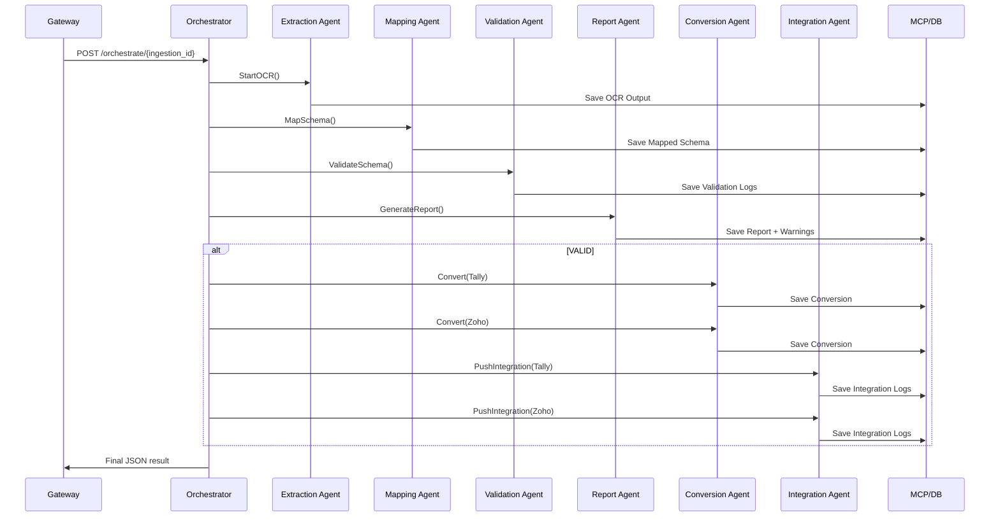

# 📦 Invoice Orchestrator Platform

### **AI-Powered Multi-Agent Document Processing System**

This repository contains a **distributed, multi-agent microservices platform** for automated invoice ingestion, OCR, schema mapping, validation, reporting, conversion to Tally XML & Zoho JSON formats, and integration with external platforms.

The system consists of the following components:

* **MCP (Master Control Program)** → DB, LLM interface, metrics, audit
* **Agents (6 microservices)**

  * Extraction Agent (OCR)
  * Mapping Agent
  * Validation Agent
  * Report Agent
  * Conversion Agent
  * Integration Agent
* **FastAPI Gateway** → Public REST API
* **LangGraph Orchestrator** → Executes the workflow
* **PostgreSQL** → Persistent storage

The architecture is fully containerized using **Docker Compose**, supports **local development**, and includes **unit + integration tests** and **GitHub Actions CI/CD**.

---

# 📁 Project Structure

```
invoice-orchestrator-platform/
├── backend/
│   ├── agents/
│   │   ├── agent_comm_pb2.py
│   │   ├── agent_comm_pb2_grpc.py
│   │   ├── common/
│   │   │   ├── mcp_client.py
│   │   │   ├── logging_config.py
│   │   │   └── validation_utils.py
│   │   ├── extraction_agent/
│   │   │   └── server.py
│   │   ├── mapping_agent/
│   │   │   └── server.py
│   │   ├── validation_agent/
│   │   │   └── server.py
│   │   ├── report_agent/
│   │   │   └── server.py
│   │   ├── conversion_agent/
│   │   │   └── server.py
│   │   └── integration_agent/
│   │       └── server.py
│   ├── gateway/
│   │   └── app/
│   │       ├── main.py
│   │       ├── routers/
│   │       ├── schemas/
│   │       ├── services/
│   │       └── dependencies/
│   ├── mcp/
│   │   ├── grpc/
│   │   │   ├── mcp_pb2.py
│   │   │   └── mcp_pb2_grpc.py
│   │   ├── db/
│   │   │   ├── engine.py
│   │   │   ├── models.py
│   │   │   └── repository/
│   │   └── server.py
│   ├── orchestrator/
│   │   ├── flow/graph.py
│   │   ├── server.py
│   │   └── clients/
│   │       ├── agents_client.py
│   │       └── mcp_client.py
│   └── tests/
├── docs/
│   ├── proto/
│   │   ├── agent_comm.proto
│   │   └── mcp.proto
│   └── db/
│       ├── ddl.sql
├── docker-compose.yml
└── README.md
```

---

# 🧠 High-Level Architecture

```mermaid
flowchart LR

A[📥 REST Gateway] -->|upload invoice| B[MCP Service]

B --> C[📄 Extraction Agent (OCR)]
C --> D[📑 Mapping Agent]
D --> E[✔ Validation Agent]
E --> F[📝 Report Agent]

E -->|VALID| G[🔄 Conversion Agent]
G --> H[🔗 Integration Agent]

E -->|INVALID| F

subgraph Orchestrator (LangGraph)
A --> I{orchestrate}
I --> C
end

H --> B
```

---

# 🗃 Database Schema Overview

Tables:

| Table                | Purpose                              |
| -------------------- | ------------------------------------ |
| `documents_ingested` | Input documents metadata             |
| `ocr_output`         | OCR results (raw_text, fields)       |
| `mapped_schema`      | Normalized canonical invoice schema  |
| `validation_logs`    | Validation results, errors, warnings |
| `reports`            | Final per-invoice reports            |
| `warnings_logs`      | Itemized warnings                    |
| `conversion_logs`    | Tally XML / Zoho JSON outputs        |
| `integration_logs`   | Response logs for Tally/Zoho         |
| `metrics`            | Agent metrics                        |
| `agent_audit`        | Detailed agent event logs            |

SQL DDL located at:

```
docs/db/ddl.sql
```

---

# 🏗️ System Workflow (Orchestrated)



---

# 🧰 Prerequisites

Install:

* Python **3.12+**
* Docker + Docker Compose
* Make (optional)
* Tesseract OCR (for extraction agent)

  * macOS: `brew install tesseract`
  * Ubuntu: `sudo apt install tesseract-ocr`

---

# ⚙️ Setup Instructions

---

## 1️⃣ Clone Repository

```bash
git clone https://github.com/yourorg/invoice-orchestrator-platform.git
cd invoice-orchestrator-platform
```

---

## 2️⃣ Install Python Dependencies (Local Development)

```bash
pip install -r requirements.txt
```

> For agents, orchestrator, MCP, and gateway, Python deps will be installed inside Docker containers if using Docker Compose.

---

## 3️⃣ Database Setup

### Start Postgres locally

```bash
docker run -d \
  --name invoice_db \
  -e POSTGRES_PASSWORD=postgres \
  -p 5432:5432 postgres:15
```

### Create schema

```bash
psql -h localhost -U postgres -f docs/db/ddl.sql
```

---

## 4️⃣ Generate gRPC Stubs

```
python -m grpc_tools.protoc \
  -I docs/proto \
  --python_out=backend/shared/grpc \
  --grpc_python_out=backend/shared/grpc \
  docs/proto/agent_comm.proto

python -m grpc_tools.protoc \
  -I docs/proto \
  --python_out=backend/shared/grpc \
  --grpc_python_out=backend/shared/grpc \
  docs/proto/mcp.proto
```

---

# 🐳 Running Full System with Docker Compose

Start the entire platform:

```bash
docker-compose up --build
```

This brings up:

| Service           | Port  |
| ----------------- | ----- |
| Gateway (FastAPI) | 8000  |
| MCP               | 50051 |
| Extraction Agent  | 6001  |
| Mapping Agent     | 6002  |
| Validation Agent  | 6003  |
| Report Agent      | 6004  |
| Conversion Agent  | 6005  |
| Integration Agent | 6006  |
| Orchestrator      | 8100  |
| Postgres          | 5432  |

---

# 🌐 Gateway Endpoints (Swagger)

Open:

🔗 **[http://localhost:8000/docs](http://localhost:8000/docs)**

Available APIs:

### ✔ `/ingestion/upload`

Upload a file (PDF/image)

### ✔ `/metrics/dashboard`

Dashboard metrics

### ✔ `/reports/generate`

Get system report

### ✔ `/convert/tally`

Convert to Tally XML

### ✔ `/convert/zoho`

Convert to Zoho JSON

### ✔ `/integration/push`

Push to Tally/Zoho

### ✔ `/orchestrate/{ingestion_id}`

Run the **full AI workflow**

---

# 🧬 Orchestrator (LangGraph)

Located at:

```
backend/orchestrator/flow/graph.py
```

Nodes:

1. Start → Ingestion Ready
2. Extraction Agent
3. Mapping Agent
4. Validation Agent
5. Report Agent
6. Branch

   * If VALID → Conversion + Integration
   * If INVALID → Stop
7. End

Graph builder:

```python
graph = StateGraph()
graph.add_node("extract", call_extraction)
graph.add_node("map", call_mapping)
graph.add_node("validate", call_validation)
graph.add_node("report", call_report)
graph.add_node("convert", call_conversion)
graph.add_node("integrate", call_integration)
graph.set_entry_point("extract")
```

---

# 🧪 Testing & CI/CD

### Running Unit Tests

```bash
pytest -q
```

### Existing Test Suites

```
backend/tests/unit/
backend/tests/integration/
backend/tests/e2e/
```

### GitHub Actions Workflow

Located at:

```
.github/workflows/ci.yml
```

Pipeline includes:

* Install Python
* Run tests
* Build Docker images
* Push to registry (optional)

---

# 🔍 Logs & Observability

Each service logs to stdout in JSON-friendly logs including:

* Timestamp
* Agent name
* Correlation ID (ingestion_id, ocr_id, etc.)
* Errors, warnings
* Duration metrics

All agents implement:

```
/health
```

or gRPC health-check.

---

# 🎯 End-to-End Demo

### 1. Upload invoice

```
POST /ingestion/upload
```

Response:

```json
{
  "ingestion_id": "ING-abcdef12",
  "status": "ACCEPTED"
}
```

### 2. Run Flow

```
POST /orchestrate/ING-abcdef12
```

Response:

```json
{
  "ocr_id": "...",
  "schema_id": "...",
  "validation_id": "...",
  "valid": true,
  "tally_conversion_id": "...",
  "zoho_conversion_id": "...",
  "tally_integration_id": "...",
  "zoho_integration_id": "..."
}
```

---

# 🚀 Roadmap

* Add real LLM extraction/mapping using OpenAI / Gemini
* Add PDF → image preprocessing
* Add async orchestration
* Add Kafka / Redis event-driven ingestion
* Add frontend dashboard (Next.js)
* Deploy to Kubernetes

---

# 🙌 Conclusion

This project gives you a **complete enterprise-grade multi-agent automation system**, built with:

* Python
* FastAPI
* gRPC
* LangGraph
* Docker
* Postgres
* AI/LLM processing
