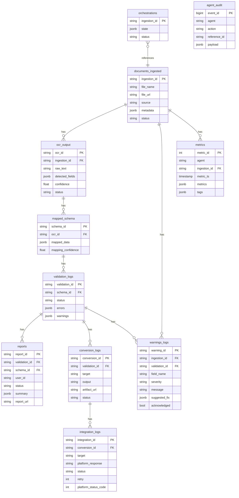

```mermaid
erDiagram
    documents_ingested ||--o{ ocr_output : "has"
    ocr_output ||--o{ mapped_schema : "has"
    mapped_schema ||--o{ validation_logs : "has"
    validation_logs ||--o{ reports : "has"
    validation_logs ||--o{ conversion_logs : "has"
    conversion_logs ||--o{ integration_logs : "has"
    documents_ingested ||--o{ warnings_logs : "has"
    validation_logs ||--o{ warnings_logs : "has"
    documents_ingested ||--o{ metrics : "has"
    orchestrations }o--|| documents_ingested : "references"

    documents_ingested {
        string ingestion_id PK
        string file_name
        string file_url
        string source
        jsonb metadata
        string status
    }

    ocr_output {
        string ocr_id PK
        string ingestion_id FK
        string raw_text
        jsonb detected_fields
        float confidence
        string status
    }

    mapped_schema {
        string schema_id PK
        string ocr_id FK
        jsonb mapped_data
        float mapping_confidence
    }

    validation_logs {
        string validation_id PK
        string schema_id FK
        string status
        jsonb errors
        jsonb warnings
    }

    reports {
        string report_id PK
        string validation_id FK
        string schema_id FK
        string user_id
        string status
        jsonb summary
        string report_url
    }

    conversion_logs {
        string conversion_id PK
        string validation_id FK
        string target
        string output
        string artifact_url
        string status
    }

    integration_logs {
        string integration_id PK
        string conversion_id FK
        string target
        string platform_response
        string status
        int retry
        int platform_status_code
    }

    warnings_logs {
        string warning_id PK
        string ingestion_id FK
        string validation_id FK
        string field_name
        string severity
        string message
        jsonb suggested_fix
        bool acknowledged
    }

    metrics {
        int metric_id PK
        string agent
        string ingestion_id FK
        timestamp metric_ts
        jsonb metrics
        jsonb tags
    }

    agent_audit {
        bigint event_id PK
        string agent
        string action
        string reference_id
        jsonb payload
    }

    orchestrations {
        string ingestion_id PK
        jsonb state
        string status
    }
```
