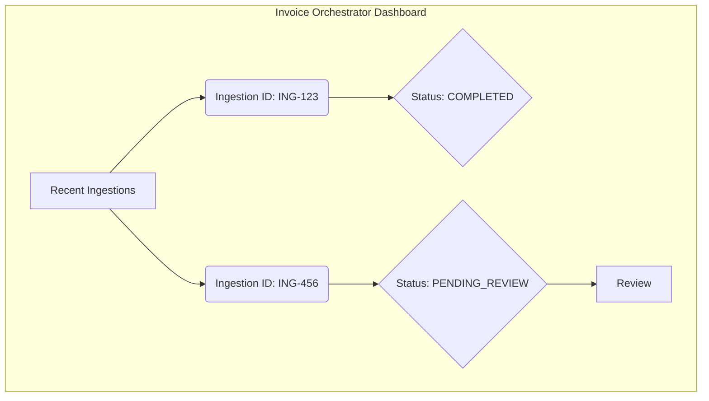

# Frontend Dashboard - Main View

```mermaid
graph TD
    subgraph "Invoice Orchestrator Dashboard"
        A[Recent Ingestions] --> B(Ingestion ID: ING-123);
        A --> C(Ingestion ID: ING-456);
        B --> D{Status: COMPLETED};
        C --> E{Status: PENDING_REVIEW};
        E --> F[Review];
    end
```
