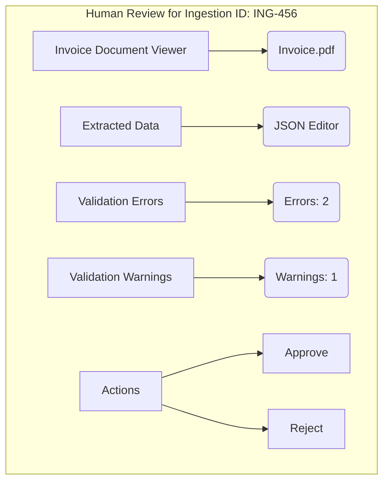

# Frontend Dashboard - Human Review

```mermaid
graph TD
    subgraph "Human Review for Ingestion ID: ING-456"
        A[Invoice Document Viewer] --> B(Invoice.pdf);
        C[Extracted Data] --> D(JSON Editor);
        E[Validation Errors] --> F(Errors: 2);
        G[Validation Warnings] --> H(Warnings: 1);
        I[Actions] --> J[Approve];
        I --> K[Reject];
    end
```
